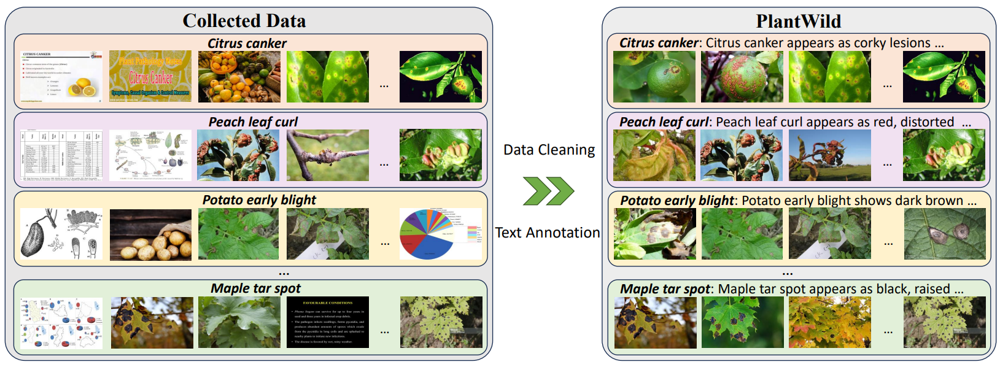
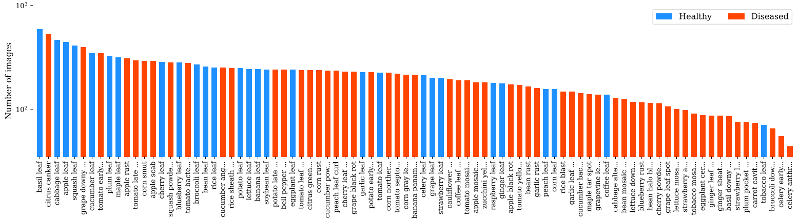
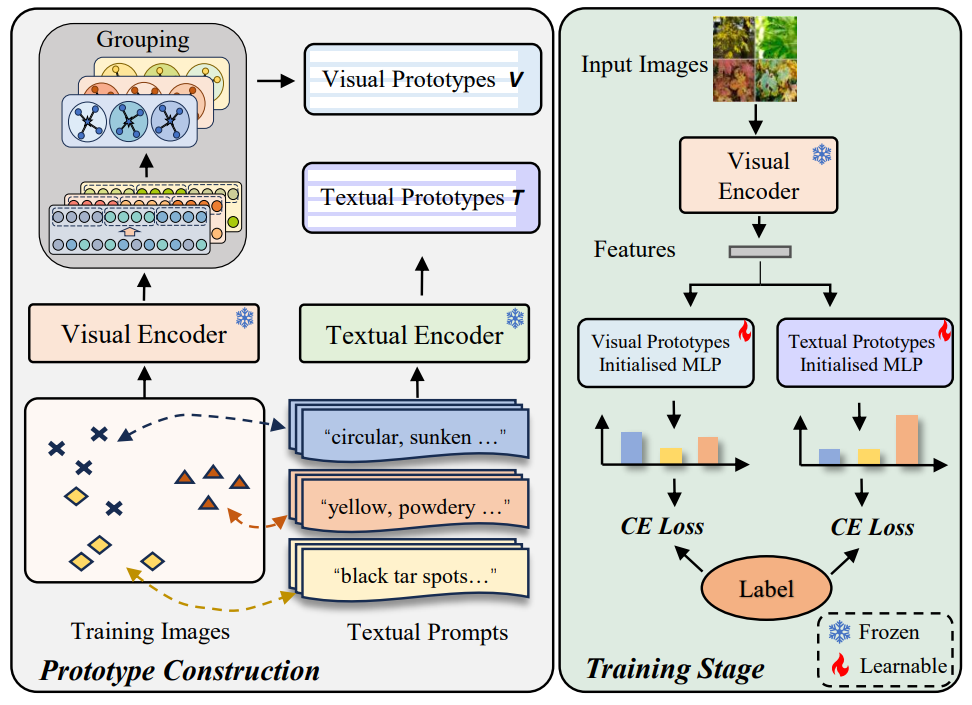

# Benchmarking In-the-Wild Multimodal Plant Disease Recognition and A Versatile Baseline
Official implementation of ['Benchmarking In-the-Wild Multimodal Plant Disease Recognition and A Versatile Baseline']

The paper has been accepted by **ACM Multimedia 2024**. 

## Introduction
We curate an in-the-wild multimodal plant disease recognition dataset PlantWild with the largest number of disease classes. We introduce descriptive prompts in our dataset to provide rich information in textual modality. In addition, we propose a strong yet versatile baseline, which models text descriptions and visual data through multiple prototypes and can achieve outstanding performance on in-the-wild plant disease images.

### Curation of our dataset

  

  

### Workflow of the baseline

  

### Dataset
Our plant dataset is accessible through [LINK].
